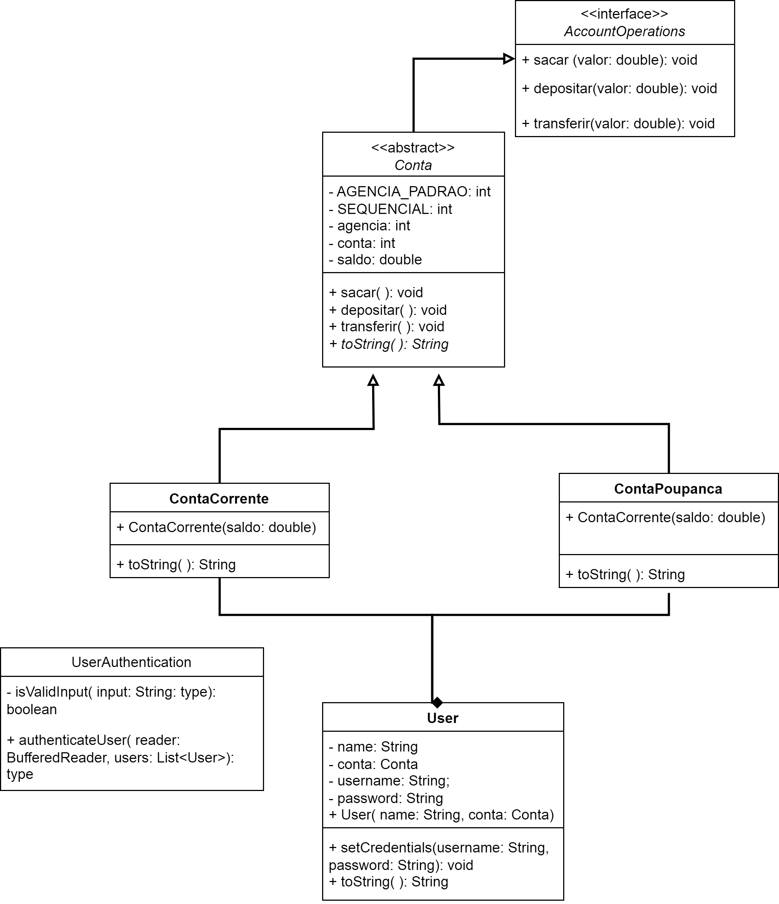

## Scope:

### 1. User Authentication:
- Users should be able to log in with their username and password.
- Only authenticated users can access banking features.

### 2. Account Management:
- Users can create different types of accounts, such as savings accounts and checking accounts.
- Each account should have a unique account number.
- Users can deposit and withdraw funds from their accounts.
- Users can check their account balance.
- Users can transfer funds between their accounts or to other users' accounts.

## Diagram class

## Object-Oriented Concepts
### Polymorphism:
- Implement different types of accounts (e.g., savings account, checking account) as subclasses of a common superclass (e.g., Account).
- Use polymorphism to perform operations on accounts without knowing their specific types.
### Interfaces:
- Implement these interfaces in concrete classes to provide functionality.
### Abstraction:
- Use abstraction to hide the implementation details of account operations from the user interface.
- Define abstract classes or interfaces to represent common behavior across different account types.
### Inheritance:
- Utilize inheritance to create specialized account types that inherit common behavior from a base account class.
- For example, a savings account may inherit from a general account class and override methods for interest calculation.

